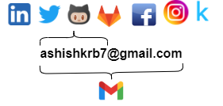

<!-- <h1 align="center">Hi Visitor👀</h1> -->
<h1> Hey! Nice to see you.</h1>

[Website](https://ashishkrb7.github.io/)

  

---
 
   

 
---

I am Research Engineer at `Siemens` Technology, doing research and working on Data Science (Computer vision(CV) and Natural Language Processing (NLP)). Previously I worked as Data Scientist at `CSS Corp`(which is now `movate`). There I handled and developed various NLP and CV projects and softwares in Customer Support domain. I started reading Computer Science books during my B.Tech. as hobby and I liked its well structured knowledge. Now, I am working full time in computer science field for last 4+ years. I have knowledge on **Programming**, **Data Analytics**, **Python Full Stacks**, **Statistics**, **Artificial Intelligence**, **Machine Learning**, **Deep Learning** and  **Geographic Information System**.

Water Resource Engineering is my major with interest in **Hydrology(Surface and Groundwater)**, **Uncertainty Analysis** and **Artificial Inteligence**.

---

About me

🔍 Proven Researcher and Data Science expert with over 4 years of hands-on experience in Statistical Modeling, Natural Language Processing, and Computer Vision. Additionally, boasting 5+ years of Python development expertise for digital applications. Passionate about diving into complex challenges and harnessing cutting-edge technology to craft predictive analytics algorithms, mathematical models, and perform hypothesis testing. Adept at utilizing a diverse toolkit to translate data into compelling narratives. Known for cultivating, expanding, and refining product portfolios that drive impact.

🚀 Key Strengths:

📚 Relentless Learner: Driven by intellectual curiosity, committed to lifelong learning.
⛅ Steadfast Composure: Thrives in adversity, maintaining a composed demeanor.
🎯 Decision Excellence: Prioritizes high-quality, data-driven decision-making.
💡 Rapid Assimilation: Quick to master new technologies, continuously enhancing skill set.

🔍 Professional Skill Set:

Data Analytics 📊 | Statistical Analysis 📈 | Simulation, Modeling & Optimization 🛠️ | Artificial Intelligence 🤖 | Machine Learning 🧠 | Deep Learning 🌐 | Geographic Information System (GIS) 🗺️ | Hydrological Modeling 🌊 | Natural Language Processing 🗣️ | Computer Vision 👁️ | Python 🐍 | R 📊 | MATLAB 🔬 | C 🖥️ | Cloud: AWS ☁️ & Azure ☁️ | Power BI 💡 | DOMO 📊 | Excel 📑 | PowerPoint 📰 | MS Word 📝 | SQL 🪛 | Git 🔄 | SCRUM 🏉 | DevOps ⚙️ | MLOps ⚙️ | SRE ⚙️ | Web Development 🌐 | Generative AI 🧠🎨

🌐 Domain Expertise:

Enterprise Software 🏢 | Geographic Information System (GIS) 🗺️ | Small Business Software 👨‍💼👩‍💼 | Water Resources Engineering 🌊💼 | Industrial Automation 🏭🤖

📣 Let's Connect! Open to engaging discussions on emerging technologies, leadership, and entrepreneurship. Reach out for illuminating conversations.

🔗 LinkedIn: https://www.linkedin.com/in/ashishkrb7

📧 Email: ashishkrb7@gmail.com

📞 Phone: 8335818761

### Cloud Computing

  

---

<!-- I am available on  [⬅️](https://www.upwork.com/o/profiles/users/~0195178efffee3692b/) -->

<h3 align="left">I use following technology stack:</h3>

 
  
<!--  -->
 
 
 
 
 

 

 
 
 
 
 
  
 
<!--   -->

  ---
  
<!--
**ashishcssom/ashishcssom** is a ✨ _special_ ✨ repository because its `README.md` (this file) appears on your GitHub profile.

Here are some ideas to get you started:

- 🔭 I’m currently working on ...
- 🌱 I’m currently learning ...
- 👯 I’m looking to collaborate on ...
- 🤔 I’m looking for help with ...
- 💬 Ask me about ...
- 📫 How to reach me: ...
- 😄 Pronouns: ...
- ⚡ Fun fact: ...
-->

<!-- ### 🌱 I’m currently learning 
 - **Microsoft Azure**
 - **IBM Cloud**
 - **Amazon Sagemaker** -->

### 🚀 What are my featured projects(open source)?

| | | | |
|---|---|---|---|
|`APIs`|`Projects`|`Developed libraries`|`List of publications`|
|||||
| [RNN chatbot](http://chatbotsenti.herokuapp.com/)| [Face mask detection](https://github.com/ashishcssom/Face_Mask_Detection_end_to_end_project)|[MongodbDatabaseEngine](https://pypi.org/project/MongodbDatabaseEngine/)|[A decision support system for the identification of critical zones in a watershed to implement land management practices](https://link.springer.com/article/10.1007/s00477-021-01983-5)|
| [Sentiment analyzer](https://sentianalyzer.herokuapp.com/)|[Object-detection-model](https://ashishtfod.herokuapp.com/)|-|-|
| [Natural language classifier](https://github.com/ashishcssom/Natural-Language-classifier)|[Face recognition for small retail shop](https://github.com/ashishkrb7/Facial-recognition-camera-for-small-retail)|-|-|
| [People also asked](https://github.com/ashishcssom/people-also-ask-API)|[EngagementAI](https://github.com/ashishkrb7/EngagementAI)|-|-|
| [Feature snippet](https://github.com/ashishcssom/Feature-snippet)|-|-|-|

To read paper online 👉🏻 [click here](https://t.co/F3eGCihHtE)

  ---
  
<!-- 🔭 I’m currently working on [AI implementation for Royal game of UR](https://github.com/ashishcssom/AI-implementation-for-game-of-UR)-->

### 📫 How to connect with me:

 
<!--[Download my CV](https://github.com/ashishkrb7/ashishkrb7/blob/master/Ashish_CV.pdf)-->

---

  
